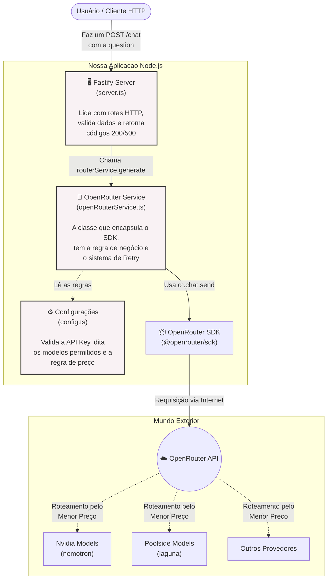

# Arquitetura do Sistema: Smart Model Router Gateway

Este documento ilustra o fluxo de dados e os componentes do projeto de Gateway Inteligente construído no curso.

## Fluxo da Aplicação

O diagrama abaixo mostra como uma requisição (pergunta) sai do usuário, passa pelos nossos arquivos de código (o Garçom, o Cozinheiro e o Gerente), e chega nas APIs das Inteligências Artificiais.

## Como Ler Este Diagrama (Analogias)

1. **Usuário:** É o cliente sentando na mesa do restaurante.
2. **Fastify Server (`server.ts`):** É o **Garçom**. Ele recebe o pedido, anota, e se o pedido der errado, ele avisa o cliente com educação (Erro 500).
3. **OpenRouter Service (`openRouterService.ts`):** É o **Cozinheiro Chefe**. Ele não atende cliente. Ele só pega a comanda, aplica a inteligência (como o sistema de tentar de novo se o fogão falhar - Retries) e conversa com o fornecedor.
4. **Config (`config.ts`):** É o **Gerente**. Ele dita a regra máxima do restaurante: "Só vamos comprar ingredientes do fornecedor mais barato (`sort by price`)".
5. **OpenRouter API:** É o "Trivago" das IAs. Ele recebe o nosso pedido e manda dinamicamente para o provedor (Nvidia, Poolside, etc) que estiver cumprindo as regras do nosso Gerente no momento.
